# Solana On-Chain Randomness & Off-Chain Security

> A teaching guide: *"Why can't we use `rand` in a Solana program?"*

---

## Table of Contents

1. [Why Random Numbers Don't Work on Solana](#1-why-random-numbers-dont-work-on-solana)
2. [How We Solve It: VRF Oracles](#2-how-we-solve-it-vrf-oracles)
3. [The Oracle Problem: Can We Trust Outside Data?](#3-the-oracle-problem-can-we-trust-outside-data)
4. [Attacks and How to Stop Them](#4-attacks-and-how-to-stop-them)
5. [Building a Safe Guessing Game](#5-building-a-safe-guessing-game)
6. [Cheat Sheet](#6-cheat-sheet)
7. [Deep Dive: Why `rand` Can't Even Compile](#7-deep-dive-why-rand-cant-even-compile)
8. [References](#8-references)

---

## 1. Why Random Numbers Don't Work on Solana

### Think of It Like This

Imagine you and 3 friends are playing a game. The rule is: **everyone must get the same answer**, or the game is broken.

Now imagine the game says "pick a random number." You pick `42`, your friend picks `73`, another picks `15`. Everyone got a **different** number. The game is broken!

That is exactly what happens on Solana.

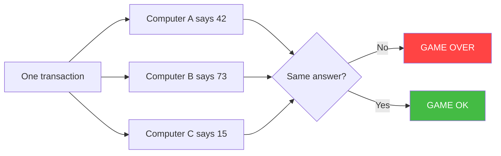

On Solana, there is no single computer. There are **hundreds of computers** (called validators). They ALL must get the **same answer** for every transaction. Random numbers give different answers on different computers. So random numbers break the system.

### Three Big Reasons `rand` Fails

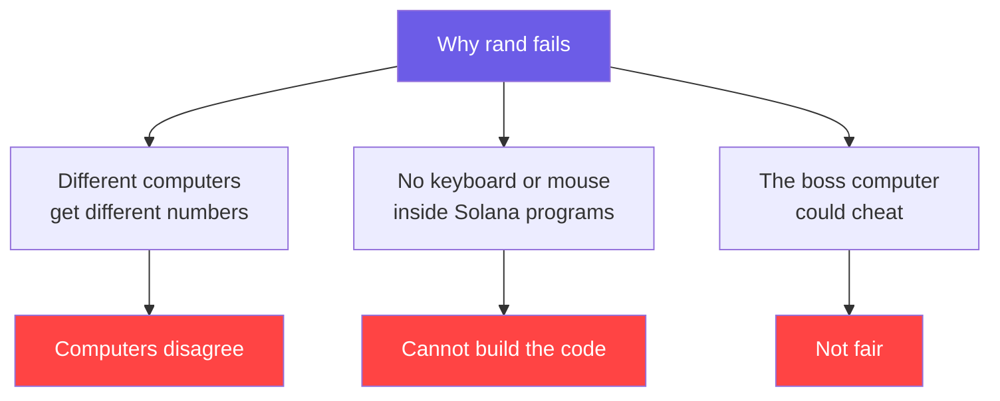

| Problem | Simple Explanation |
|---------|-------------------|
| Different answers | Each computer picks its own random number. They disagree. |
| No system access | Solana programs live in a tiny box with no keyboard, no mouse, no random source. |
| Cheating | Even if it worked, the computer running the game could pick a number that helps it win. |

---

## 2. How We Solve It: VRF Oracles

### The Idea

Instead of asking the Solana computer to pick a random number, we ask a **trusted helper outside** (called an **oracle**) to do it. But the helper must bring a **mathematical proof** that the number is truly random and not cheating.

Think of it like a teacher who picks a number and writes it in a **sealed envelope**. When it's time to reveal, everyone can check that the envelope was never opened or changed.

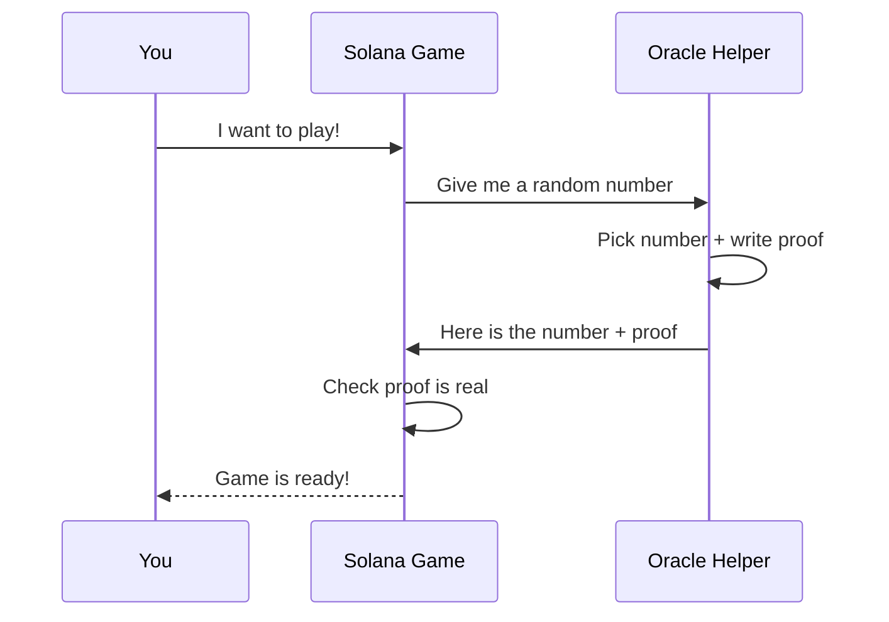

### Why This Is Safe

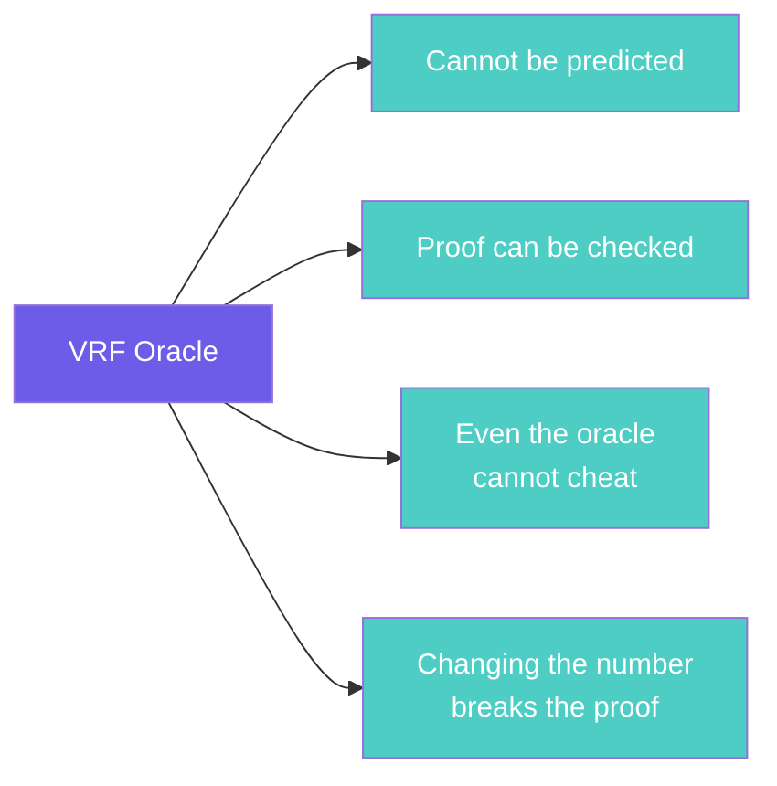

---

## 3. The Oracle Problem: Can We Trust Outside Data?

### The Big Question

When we ask a helper outside Solana for data, how do we know they are telling the truth?

Your teacher told you: **"If you go outside, you must lock the door as tightly as possible."** That means: if you use outside data, you must verify it as much as possible.

### The Trust Ladder

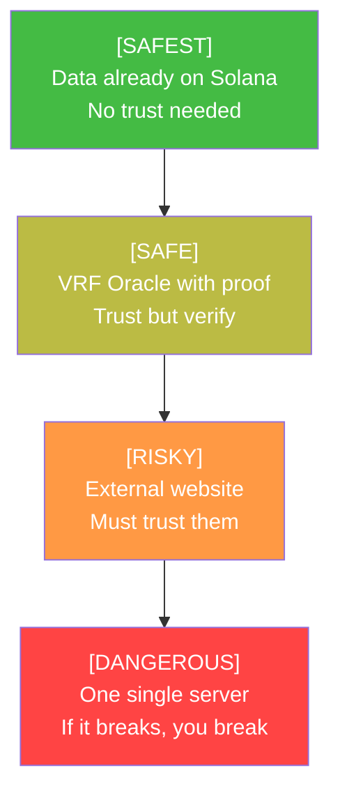

### Two Ways to Use Outside Data

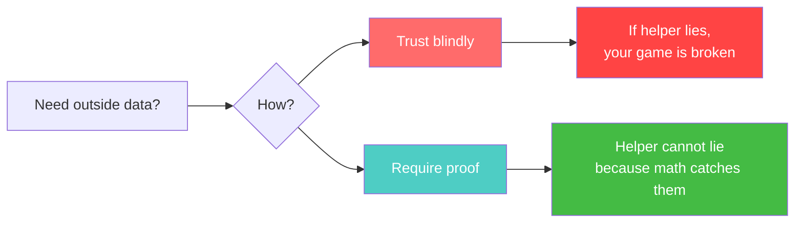

---

## 4. Attacks and How to Stop Them

### The 5 Bad Things That Can Happen

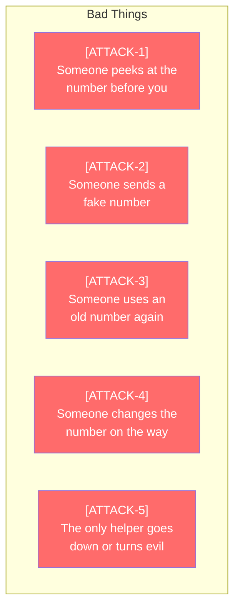

### The 5 Fixes

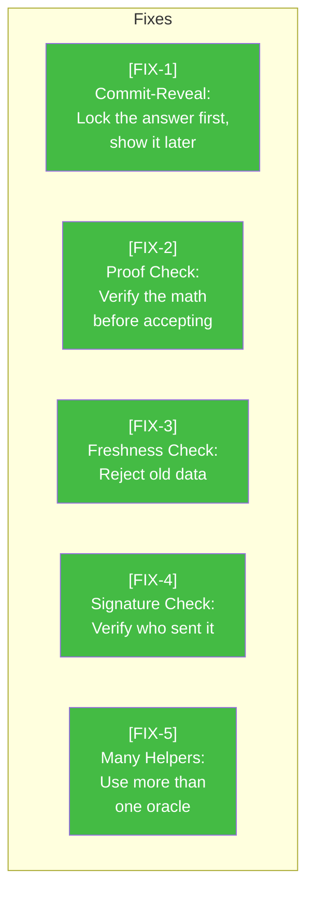

### Attack vs Fix Map

| Attack | What Happens | Fix | How It Stops It |
|--------|-------------|-----|----------------|
| [ATTACK-1] Peeking | Bad person sees the number in the waiting line and acts first | [FIX-1] Commit-Reveal | Lock the answer in a box first. Nobody can peek until it's locked. |
| [ATTACK-2] Fake number | Someone sends a made-up number to your game | [FIX-2] Proof Check | The number must come with math proof. Fake numbers fail the math test. |
| [ATTACK-3] Old number | Someone sends an old number that was valid before | [FIX-3] Freshness Check | Your game checks the time. Old numbers get rejected. |
| [ATTACK-4] Changed number | Someone changes the number while it's traveling | [FIX-4] Signature Check | The number is signed. If it changes, the signature breaks. |
| [ATTACK-5] One helper fails | Your only helper breaks or turns evil | [FIX-5] Many Helpers | Use several helpers. If one is bad, the others catch it. |

### Commit-Reveal: The Most Important Fix

Think of it like this:

1. **COMMIT** -- The helper writes a number on paper, puts it in a locked box, and gives you the box. Nobody can see the number. But the box has a label (a hash) so nobody can swap the paper.

2. **REVEAL** -- Later, the helper opens the box and shows the number with proof. You check: does this match the label on the box? If yes, it's safe.

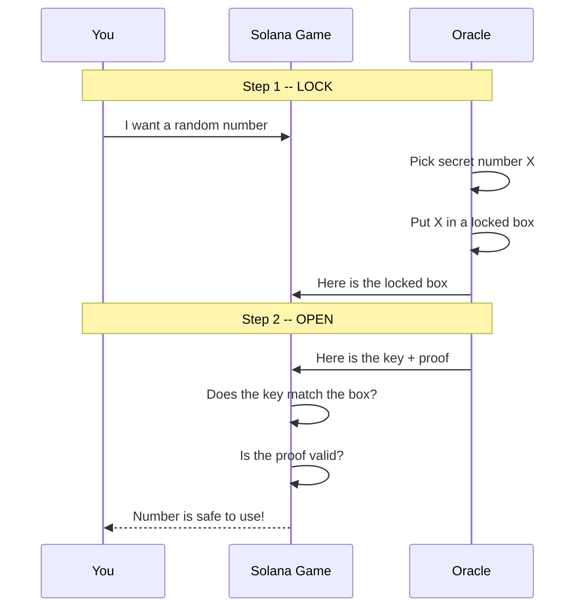

### What Happens Without Commit-Reveal

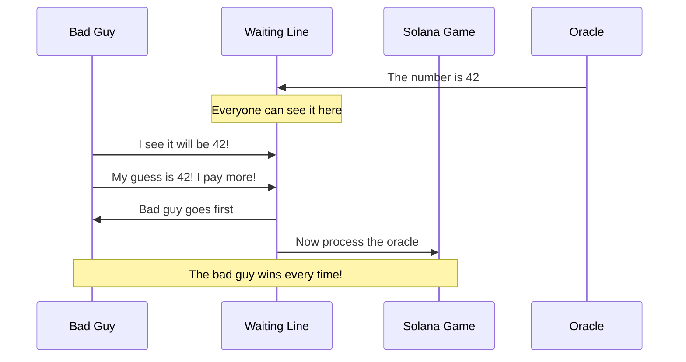

---

## 5. Building a Safe Guessing Game

### The Full Picture

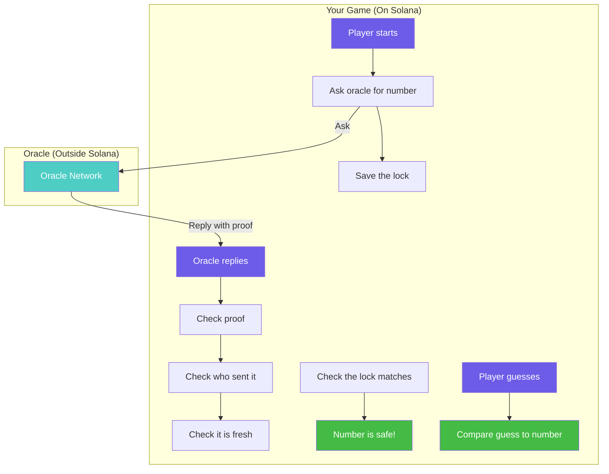

### The Security Gate

Every time outside data arrives, your game should run it through this checklist:

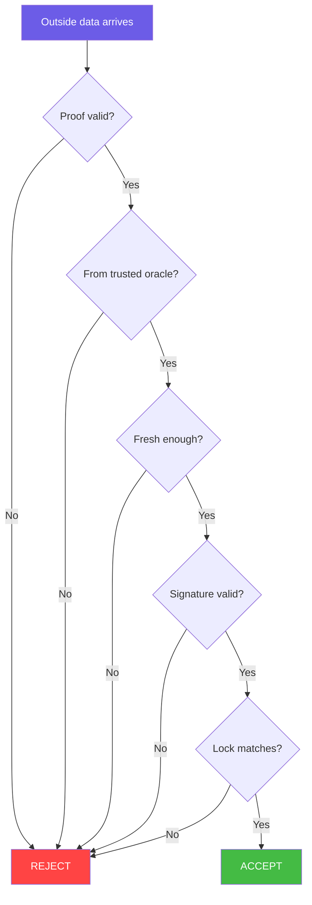

If ANY check fails, throw the data away. Only accept if ALL checks pass.

### What the Code Looks Like

```rust
fn process_randomness(ctx: Context<ReceiveRandomness>, result: u64) -> Result<()> {
    // [CHECK-1] Is the math proof valid?
    verify_vrf_proof(&ctx.accounts.vrf_account, result)?;

    // [CHECK-2] Did this come from the right oracle?
    require!(
        ctx.accounts.oracle.key() == EXPECTED_ORACLE_PUBKEY,
        ErrorCode::UnauthorizedOracle
    );

    // [CHECK-3] Is this data fresh, not old?
    let current_slot = Clock::get()?.slot;
    require!(
        current_slot - ctx.accounts.vrf_account.last_update_slot < MAX_STALENESS,
        ErrorCode::StaleData
    );

    // [CHECK-4] Does the locked box match?
    require!(
        hash(result.to_le_bytes()) == ctx.accounts.commitment.hash,
        ErrorCode::CommitmentMismatch
    );

    // All checks passed! Safe to use.
    game.secret_number = (result % 100) + 1;

    Ok(())
}
```

---

## 6. Cheat Sheet

### Quick Summary

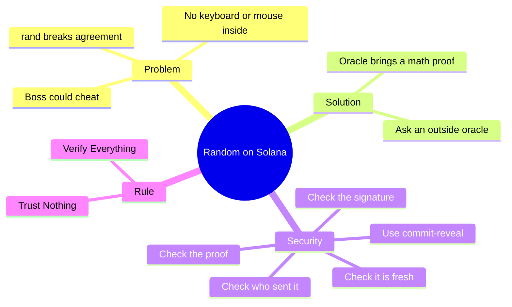

### Which Approach Should You Use?

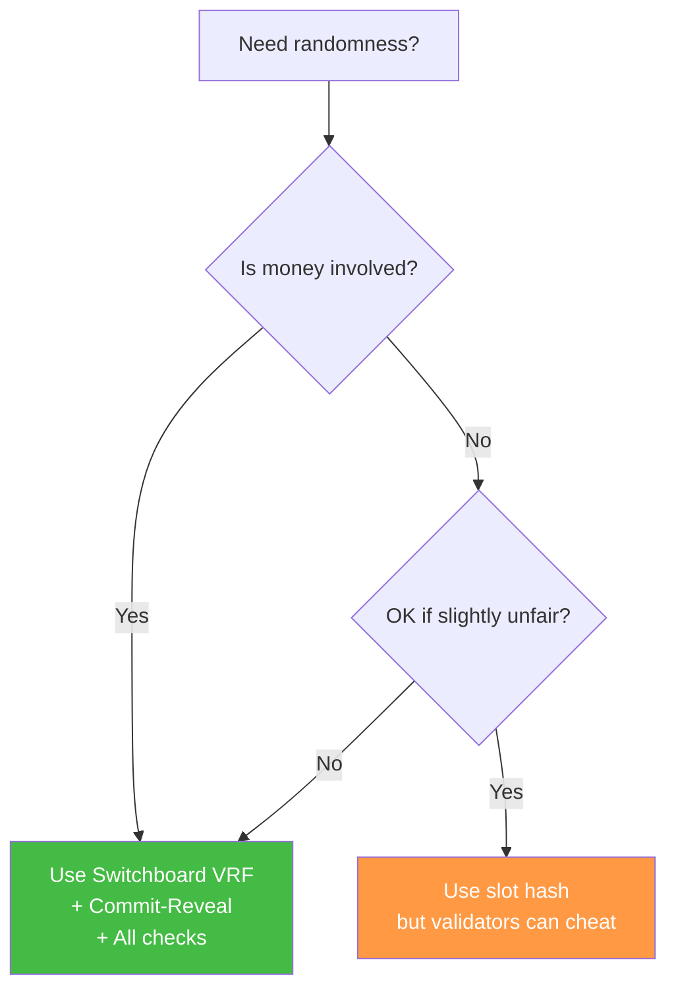

### 8 Rules to Remember

| # | Rule | Why |
|---|------|-----|
| 1 | Never use `rand` on-chain | Computers will disagree and break |
| 2 | Use VRF oracles | They give random numbers with proof |
| 3 | Verify everything | Never trust outside data blindly |
| 4 | Use commit-reveal | Stops people from peeking |
| 5 | Check timestamps | Stops people from using old data |
| 6 | Check who sent it | Only trust known oracles |
| 7 | Check signatures | Stops tampered data |
| 8 | Use many oracles | Stops one bad oracle from ruining everything |

---

## 7. Deep Dive: Why `rand` Can't Even Compile

### What Is rBPF?

Solana programs do not run on a real computer. They run inside a **tiny pretend computer** called **rBPF**. Think of it like a video game console that can only run certain games.

> **[REF]** [solana_rbpf crate documentation](https://docs.rs/solana_rbpf/latest/solana_rbpf/) -- *"Virtual machine and JIT compiler for eBPF programs."*

### Your Laptop vs. Solana

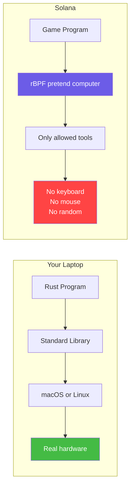

On your laptop, `rand` works because it can ask the operating system for a random number. The operating system gets it from the hardware. But inside rBPF, there is no operating system and no hardware. Just a tiny empty room.

### What Can and Cannot Run Inside rBPF

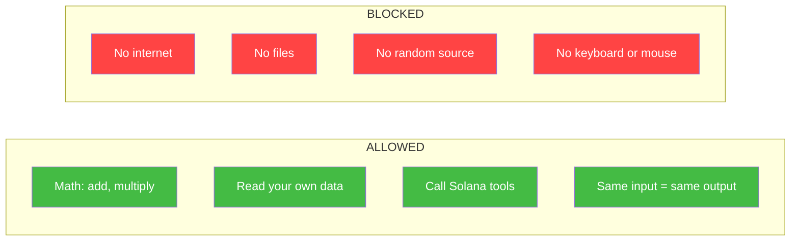

### How rBPF Stops Bad Programs

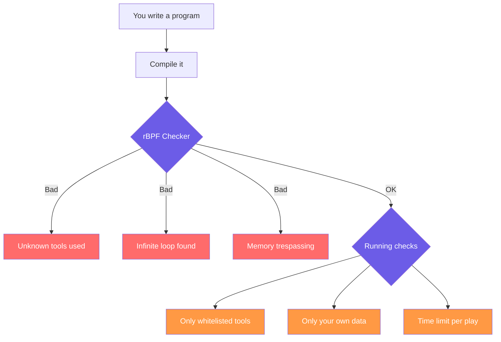

### What Happens When You Try to Use `rand`

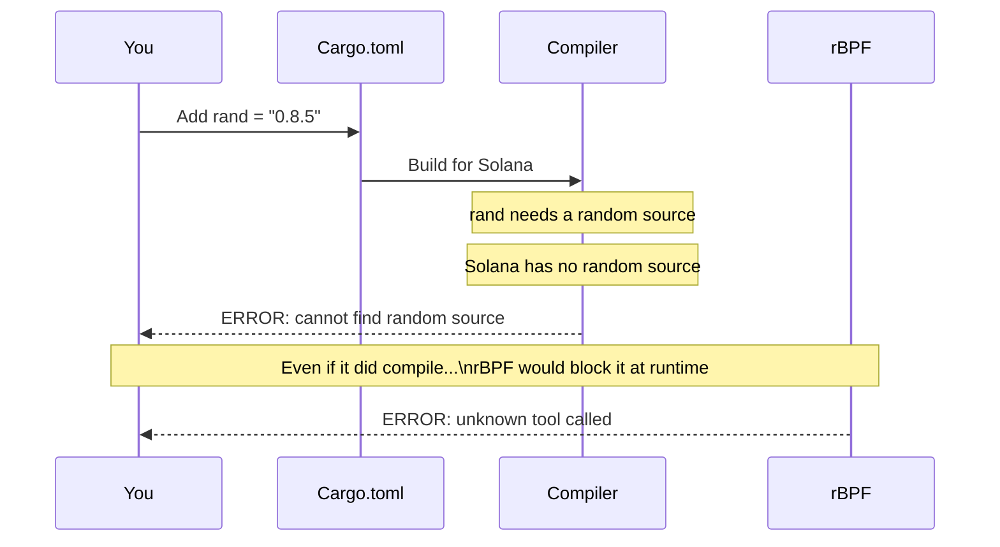

### Important rBPF Modules

From the [solana_rbpf docs](https://docs.rs/solana_rbpf/latest/solana_rbpf/):

| Module | What It Does | Why It Matters |
|--------|-------------|---------------|
| [`vm`](https://docs.rs/solana_rbpf/latest/solana_rbpf/vm/index.html) | The pretend computer that runs your program | Controls what can and cannot run |
| [`syscalls`](https://docs.rs/solana_rbpf/latest/solana_rbpf/syscalls/index.html) | The allowed list of tools | No randomness in this list |
| [`verifier`](https://docs.rs/solana_rbpf/latest/solana_rbpf/verifier/index.html) | Checks your program before it runs | Catches bad programs early |
| [`interpreter`](https://docs.rs/solana_rbpf/latest/solana_rbpf/interpreter/index.html) | Runs programs step by step | Another way to run your code |
| [`elf`](https://docs.rs/solana_rbpf/latest/solana_rbpf/elf/index.html) | Loads your compiled program | How your game gets into Solana |
| [`assembler`](https://docs.rs/solana_rbpf/latest/solana_rbpf/assembler/index.html) | Turns code into machine instructions | Low-level details |

---

## 8. References

### Primary

| Resource | Link | What It Is |
|----------|------|-----------|
| **solana_rbpf** | [docs.rs/solana_rbpf](https://docs.rs/solana_rbpf/latest/solana_rbpf/) | The pretend computer that runs Solana programs |
| **The Rust Book Ch.2** | [doc.rust-lang.org](https://doc.rust-lang.org/book/ch02-00-guessing-game-tutorial.html) | The guessing game tutorial this project is based on |

### Randomness Solutions

| Resource | Link | What It Is |
|----------|------|-----------|
| **Switchboard VRF** | [docs.switchboard.xyz](https://docs.switchboard.xyz/randomness) | A helper that gives random numbers with proof |
| **Pyth Entropy** | [pyth.network](https://pyth.network/entropy) | Another random number helper |

### Security

| Resource | Link | What It Is |
|----------|------|-----------|
| **Solana Security Checklist** | [GitHub](https://github.com/solana-foundation/solana-dev-skill) | A list of things to check before going live |
| **Commit-Reveal Scheme** | [Wikipedia](https://en.wikipedia.org/wiki/Commitment_scheme) | The lock-then-open trick explained |

### Solana Runtime

| Resource | Link | What It Is |
|----------|------|-----------|
| **Solana Runtime Docs** | [docs.solanalabs.com](https://docs.solanalabs.com/runtime) | How programs run on Solana |
| **eBPF on Solana** | [docs.solanalabs.com](https://docs.solanalabs.com/proposals/abi) | Technical details about the pretend computer |

---

> **"Trust nothing, verify everything."** -- The Golden Rule of Off-Chain Security
